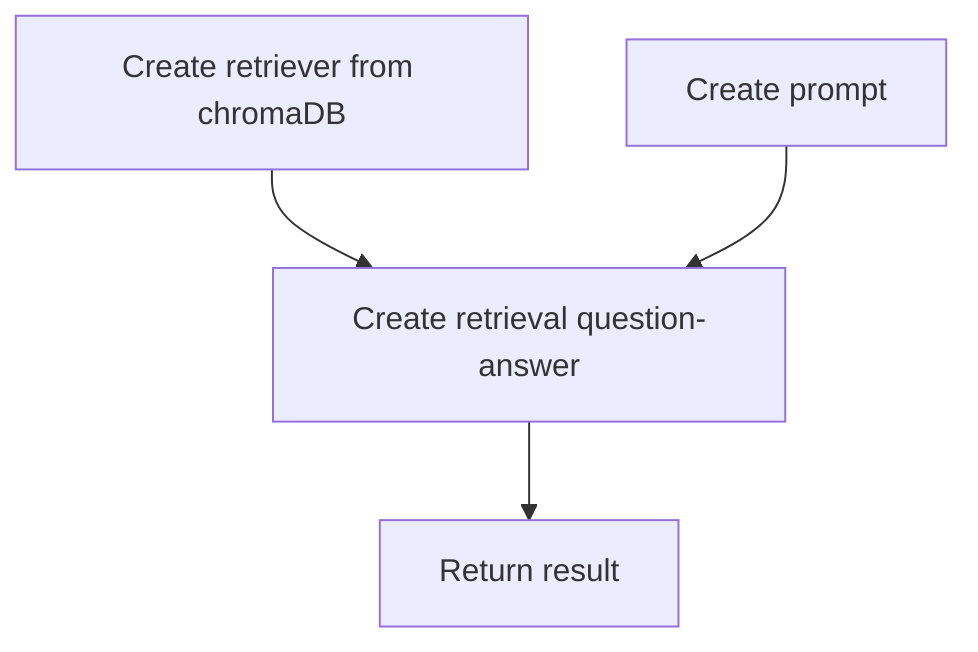

## install langchain[llms]
```shell
pip install langchain[llms]
```

## install library in requirements.txt
```shell
pip install -r requirements.txt
```

## Workflow upload file
> input parameters: profile_id, files


## Workflow embedding document
> input parameters: profile_id


## Workflow query document
> input parameters: profile_id, query

## Reference
- [LocalGPT] [https://github.com/PromtEngineer/localGPT